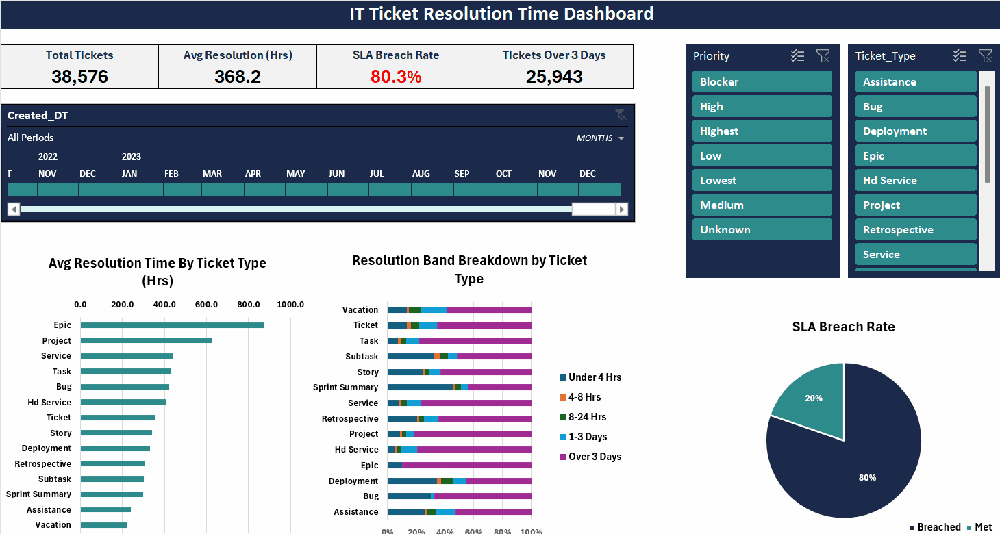
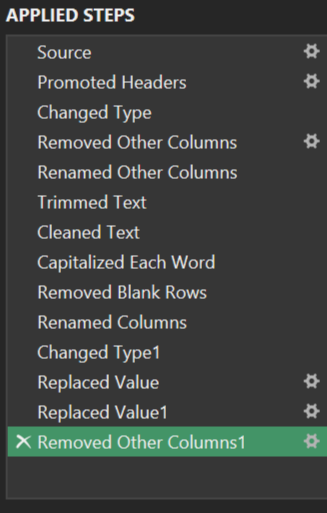
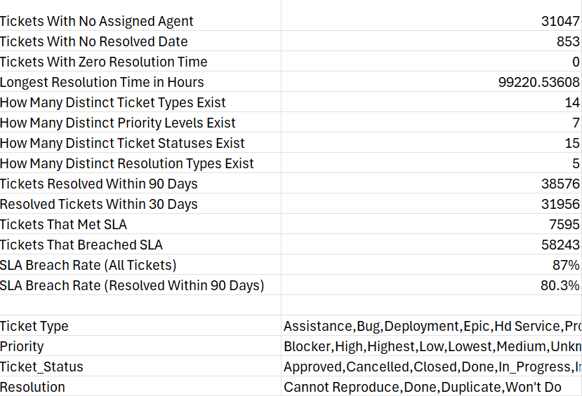
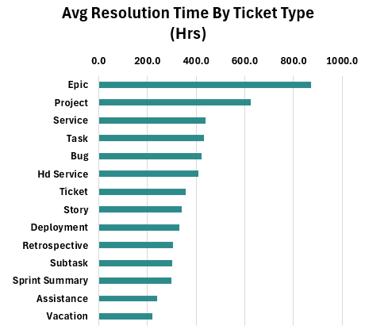
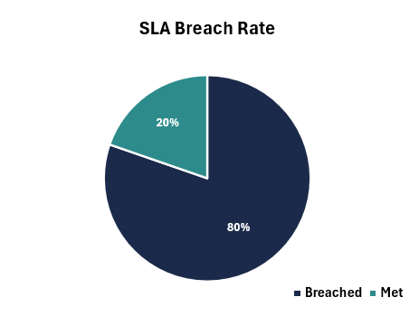
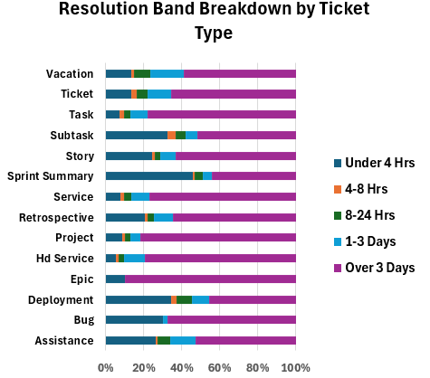

# 🎫 IT Ticket Resolution Time Dashboard
 

 
## Introduction
 
I built this dashboard to look at real IT helpdesk ticket data and find out which ticket types take the longest to resolve and why SLA targets are being missed.
 
The data comes from Mendeley Data - Help Desk Tickets - (https://data.mendeley.com/datasets/btm76zndnt/2) and covers 2007 to 2023 - **66,691 tickets** in total.
 
## Dashboard File
 
The final dashboard is `IT_Ticket_Resolution_Time_Dashboard.xlsx`.
 
## Excel Skills Used
 
- 🔍 **Power Query**  - cleaning and transforming the data
- 📊 **PivotTables & PivotCharts**
- 🧮 **Formulas** - XLOOKUP, IF, COUNTIFS, IFERROR, GETPIVOTDATA
- 🎛️ **Slicers & Timeline** - interactive filters
- ❎ **Data Validation** - checking the data before analysing it

## Dataset
 
The dataset includes:
 
- 🎫 Ticket IDs and types (14 different types)
- 🏷️ Priority levels (7 levels from Blocker to Lowest)
- 📅 Created and resolved dates
- 👤 Who reported and who was assigned the ticket
- ✅ How the ticket was resolved
- 💬 Number of comments on each ticket
---
 
# Dashboard Build
 
## 🔍 Data Cleaning - Power Query
 
The raw data needed quite a bit of tidying up before I could analyse it:
 
- Removed columns I didn't need, including `Workflow_Time_Sec` which had unreliable values (some over 11 years)
- Renamed columns so they were clear and consistent
- Trimmed whitespace and fixed the text casing
- Fixed inconsistent values like `Sub-Task` → `Subtask` and `Won'T Do` → `Won't Do`
- Set the right data types for each column


 
---
 
## ❎ Data Validation
 
Before jumping into the analysis, I checked the data for any issues:
 
- The longest resolution time was **99,220 hours** - that's over 11 years, clearly an outlier
- **853 tickets** had no resolved date at all
- There are **14 ticket types** and **7 priority levels** in the data
- **38,576 tickets** were resolved within 90 days
Because of those extreme outliers, I filtered the main analysis down to tickets resolved within **90 days**. This gives a much more realistic picture of actual performance.
 

 
---
 
## 🧮 Formulas
 
### 💰 SLA Target Lookup
 
```
=XLOOKUP([@Priority],Lookups!$A$2:$A$8,Lookups!$B$2:$B$8)
```
 
Each ticket gets an SLA target based on its priority. I set these up using ITIL best practice since the company's actual targets weren't available (Blocker 2hrs, Highest 4hrs, High 8hrs, Medium 24hrs, Low 48hrs, Lowest 72hrs, Unknown 24hrs).
 
### ✅ SLA Met or Breached
 
```
=IF([@Resolution_Hrs]="","",IF([@Resolution_Hrs]<=[@SLA_Target_Hrs],"Met","Breached"))
```
 
Checks if the ticket was resolved within its SLA target. If there's no resolved date, it returns blank.
 
### 📊 Resolution Band
 
```
=IF(L2="","",XLOOKUP(L2,Lookups!$C$2:$C$6,Lookups!$D$2:$D$6,,-1))
```
 
Groups each ticket into a time band - Under 4 Hrs, 4-8 Hrs, 8-24 Hrs, 1-3 Days, or Over 3 Days. I used XLOOKUP with approximate match here instead of nested IFs because nested IFs across 66,691 rows was crashing Excel.
 
### 🛡️ KPI Error Handling
 
```
=IFERROR(GETPIVOTDATA("SLA_Met",Analysis!$G$3,"SLA_Met","Breached")/GETPIVOTDATA("SLA_Met",Analysis!$G$3),0)
```
 
This powers the SLA Breach Rate on the dashboard. The IFERROR wrapper stops the KPI card showing #REF! when someone filters to a combination with no matching tickets.
 
---
 
## 📊 Charts
 
### 📈 Avg Resolution Time by Ticket Type
 
Horizontal bar chart showing the average hours to resolve each ticket type. Epic tickets are the slowest at 872 hours - (36 days), which is over 4 times the overall average.
 

 
### 🥧 SLA Breach Rate
 
A simple pie chart showing that **80.3% of tickets breach their SLA target**. Only 1 in 5 tickets gets resolved in time.
 

 
### 📊 Resolution Band Breakdown
 
A 100% stacked bar showing what proportion of each ticket type falls into each time band. The big takeaway - **67% of all tickets take over 3 days** to resolve.
 

 
---
 
## 🎛️ Slicers & Timeline
 
The dashboard has Priority and Ticket Type slicers plus a date Timeline. All three are connected to every pivot table, so clicking any filter updates the whole dashboard at once.
 

 
---
 
## ⚠️ Assumptions & Limitations
 
- The analysis only includes tickets resolved within 90 days to keep the averages meaningful.
- 853 tickets with no resolved date are left out of the resolution time analysis.
- 31,047 tickets had no one assigned to them - I kept these in since resolution time is still valid.
---
## 👤 Key Insights and Recommendations
Context: SLA results calculated using ITIL based targets and tickets resolved within 90 days.
Key insights
- 80.3% of tickets breach SLA.
- 67% of tickets take over 3 days to resolve.
- Epic tickets average 872 hours to resolve (36 days).
Recommendations
- Audit triage and classification to ensure tickets are routed correctly.
- Require assignment on ticket creation to reduce backlog.
- Rebalance workload across assignees 
- Review SLA targets by ticket type (treat Epics separately).
Next steps
Analyse assignee workload, time to first response, and ticket lifecycle to prioritise fixes.

 ---
## 🔍 Conclusion
 
This project was a good exercise in working with a large, messy real-world dataset. The main finding is that 80% of tickets miss their SLA target and two-thirds take over 3 days to resolve - pointing to either over-ambitious targets or a capacity issue.
